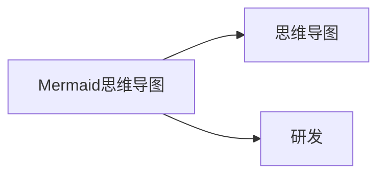

# Notion-Markdown


[Notion示例文章源地址](https://1874.notion.site/Notion-0658ee89cadf4d0e9b6adfbb1d953c70)


## 行内样式


- **加粗**


_斜体_


<u>下划线</u>


删除线


行内代码 `const a = 123`


行内公式，在Vitepress会报错，不做演示


红色的文字


蓝色的文字背景


绿色的块背景


## Basic block（基本块）


## Notion示例文章的子页面

Notion示例文章的子页面


| 表格标题 | 备注              |
| ---- | --------------- |
| 测试1  | 啊大大             |
| 测试2  | `const a = 123` |

- 无序列表
1. 有序列表：事物按规律变化，也有一种不可避免的性质．这种性质就叫做**必然性**
    1. 事物的必然性，是事物本身的性质（我们反对宿命论的是其认为这一切是受神明的支配，而不是反对事物发展中存在的不可避免的性质的事实）
        1. 第三级别列表
        2. 第三级别列表
    2. 其决定于它自己本身发展的情况和周围的条件
        1. 第三级别列表
            1. 第三级别列表
<details>
<summary>折叠块：点击展开【一级】</summary>
<details>
<summary>点击展开【二级】</summary>
<details>
<summary>点击展开【三级】</summary>

内容文本


</details>


</details>


</details>

> 引用块

---


> 👏 标注文本：**Elog 0.4.0-beta.7 发布了！**  
> 开放式跨平台博客解决方案，随意组合写作平台和部署平台  
>   
> 帮助导航👇  
> ❓ [Elog能干什么](https://elog.1874.cool/notion/introduce)  
> 🚀 [快速开始](https://elog.1874.cool/notion/start)


## Media（媒体）


[bookmark](https://elog.1874.cool)


```python
pwd='123456'
print(f"password={pwd!r}")

## output:
#password='123456'
```


## DataBase（数据库）


数据库


## AI block


API不支持，会报错`Block type ai_block is not supported via the API.`


## Advanced block（高级块）


$$
f\left(\left[\frac{1+\{x, y\}}{\left(\frac{x}{y}+\frac{y}{x}\right)(u+1)}+a\right]^{3 / 2}\right)\tag{行标}
$$


Notion示例文章的同步块


# 折叠一级标题


    ## 折叠二级标题


        折叠内容


两列分栏（左）

- [ ] 左侧书写

两列分栏（右）

- [ ] 右侧书写




@Anonymous 


[Untitled](https://www.notion.so/f478ef37c82a41f1b7a59c195b043831) 


2023-04-26 


🚀🔥🐸


## Embeds（嵌入）


嵌入网页


[embed](https://elog.1874.cool)

