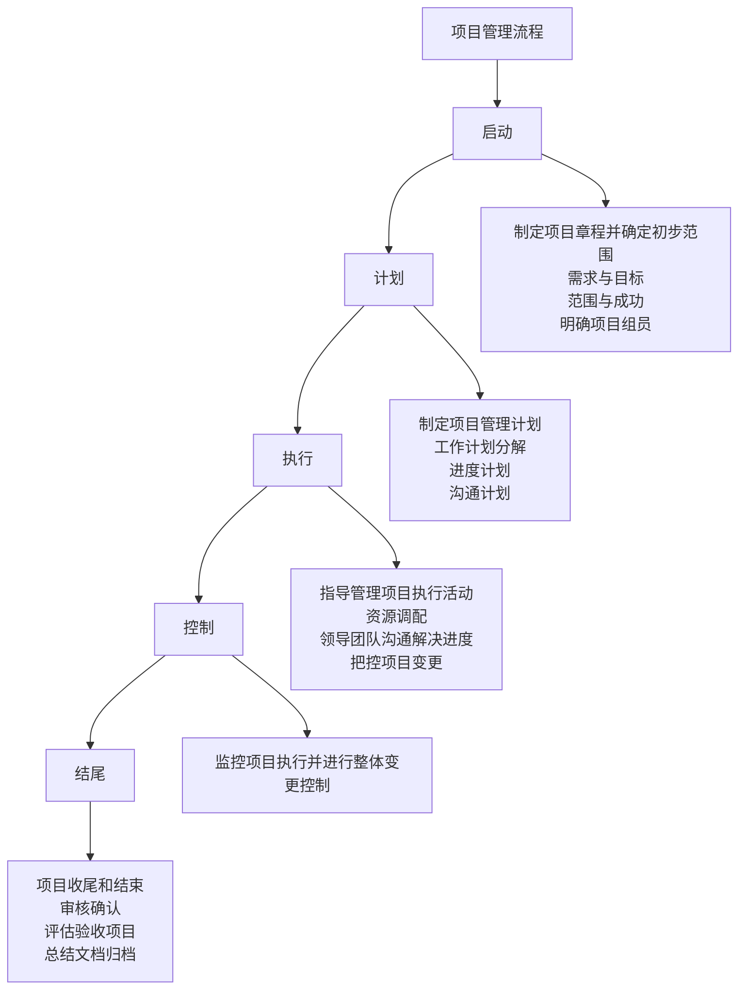
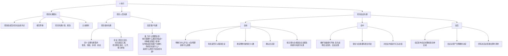
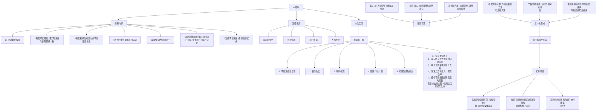

## 项目管理流程





### 启动

```mermaid
graph TD
    A[启动] --> B[启动内容]
    A --> C[项目经理责任]
    A --> D[项目组成员责任]
    A --> E[启动阶段三个关键点]
    A --> F[启动阶段常见问题]

    B --> B1[1. 明确项目需求]
    B --> B2[2. 确定项目目标]
    B --> B3[3. 定义项目相关方的期望值]
    B --> B4[4. 描述基本的项目范围]
    B --> B5[5. 选择基本的项目组成员]
    B --> B6[6. 明确项目经理]
    B --> B7[7. 确认要交付的文档]
    B --> B8[8. 由管理层、项目经理确认]

    C --> C1[1. 与客户沟通协商，明确项目需求和所需资源等]
    C --> C2[2. 在项目实施过程中不断了解客户需求]
    C --> C3[3. 保证与项目相关方的沟通并汇报项目进程]
    C --> C4[4. 挑选项目组成员，得到项目组的支持服务]
    C --> C5[5. 项目计划过程中领导和指导项目组成员服务]
    C --> C6[6. 挑选控制项目进程，保证项目按时间计划执行]

    D --> D1[1. 参与项目计划的制定]
    D --> D2[2. 服从项目经理的指挥，执行计划分配的任务]
    D --> D3[3. 保持与项目经理的沟通]
    D --> D4[4. 配合其他小组成员的工作]
    D --> D5[5. 项目核心成员对项目经理负责，保证的完成]

    E --> E1[1. 与客户、高层间沟通，明确项目需求并获得相关支持]
    E --> E2[2. 明确项目需求和目标]
    E --> E3[3. 开会讨论，明确团队并执行相关要求]

    F --> F1[需求不明确及需要沟通不够]
    F --> F2[项目组成员的选择]
    F --> F3[为促成项目，过于乐观地分析可行性]
```





### 计划

```mermaid
graph TD
    A[2 计划] --> B[计划内容]
    A --> C[计划阶段]
    
    B --> B1[具体工作任务和执行次序风险分析]
    B --> B2[风险分析]
    B --> B3[得到相应的项目相关方批准的项目计划]
    B --> B4[工具: 甘特图, 里程碑, 网络图, 思维导图]
    
    C --> C1[管理计划 时间, 范围, 风险, 沟通等]
    C --> C2[工作任务分解]
    C --> C3[任务工期估算]
    C --> C4[时间进度安排]
    C --> C5[风险与沟通计划]
    C --> C6[项目预算计划]
    C --> C7[明确项目范围及具体任务]
    C --> C8[全面的风险识别]
    C --> C9[各关键人员的识别与沟通计划]
    
    B --> D[三个关键点]
    D --> D1[主要任务]
    D --> D2[主要成果]
    D --> D3[常见问题]
    
    D2 --> E[任务分解计划]
    D2 --> F[时间进度计划]
    D2 --> G[沟通计划]
    
    D3 --> H[对工作任务分解不充分]
    D3 --> I[风险意识不强, 没有沟通计划]
    D3 --> J[计划缺乏个人责任, 项目组没有共识认识]
    
    K[工作任务分解] --> L[1. 你的项目目标是什么?项目目标的具体任务你怎么分?]
    K --> M[2. 分解的原则需全方位, 彻底独立]
    K --> N[3. 分解的方法自上而下, 头脑风暴]
    K --> O[4. 表达的形式]
    K --> P[5. 最小粒度的特征]
    
    P --> P1[一个清晰任务的完成]
    P2[一个清晰的责任人]
    P3[时间估算工期和工作量]
    
    Q[根据项目任务的执行顺序, 时间计划及所需资源来进行分析, 制定计划] --> R[进度计划] --> S[主要工具]
    
    S --> S1[甘特图 工作分解结构WBS, 责任分配矩阵RAM]
    S --> S2[里程碑]
    S --> S3[网络图]
    
    R --> T[风险计划]
    
    T --> T1[1. 识别风险]
    T --> T2[2. 评估风险等级]
    T --> T3[3. 制定风险的应对计划]
    T --> T4[4. 制定所有计划中有可能出现的风险]
    T --> T5[5. 分析执行中可能会出现的问题]
    T --> T6[6. 与项目组员一一头脑风暴]
    T --> T7[7. 回顾以往项目中曾出现的问题三大类别: 交期, 准确, 给到评价]
    
    R --> U[沟通计划]
    
    U --> U1[沟通计划是根据项目任务的执行顺序, 时间计划及所需资源来进行分析, 制定计划]
    
    V[四个沟通渠道] --> V1[正式沟通在项目的时间节点上, 通过正式的渠道传达给项目相关人, 开展必要的沟通活动]
    
    W[如何指定项目沟通制度?]
    
    W --> W1[程序干系人]
    W --> W2[所需信息]
    W --> W3[频率]
    W --> W4[方法]
    W --> W5[责任人]
    
    X[高层管理] --> X1[项目进度, 成本, 进度, 质量及效益情况]
    X --> X2[每月]
    X --> X3[报告会议]
    X --> X4[项目经理]
    
    Y[职能管理] --> Y1[问题及目标行为]
    Y --> Y2[每周]
    Y --> Y3[报告会议]
    Y --> Y4[项目经理]
    
    Z[实施] --> Z1[视导团队]
    Z --> Z2[促进解决问题]
    Z --> Z3[和谐队伍氛围]
    Z --> Z4[保证计划所需的资源]
```





### 执行





### 控制





### 收尾


```mermaid
graph TD
    A[5 收尾] --> B[收尾流程]
    B --> C[评估及验收]
    B --> D[项目总监]
    B --> E[领导审核并确认]
    B --> F[文档归档]

    G[项目结束] --> H[01财务: 评估投资回报率, 评估实际费用与计划费用]
    G --> I[02时间: 与计划的一致性]
    G --> J[03质量: 项目输出的表现水平, 客户对质量的感受]
    G --> K[04人力资源: 团队精神, 激励, 态度调查]
    G --> L[05环境: 环境因素对项目活动的影响]
    G --> M[06项目计划: 计划流程的费用评估及适当的管理技术的使用]

    N[归档文档] --> O[启动]
    N --> P[计划执行]
    N --> Q[监控]
    N --> R[收尾]

    O --> S[方案合同项目基本信息表]
    P --> T[阶段时间安排项目综合计划表等]
    Q --> U[项目会议纪要变更说明, 审核记录, 阶段性报告, 相关文献]
    R --> V[项目结果文档, 项目评审验收报告, 项目总结报告, 项目交付的其他文档]

    B --> W[收尾内容]
    W --> X[项目总结]
    W --> Y[项目收尾分类]

    X --> Z[项目总结表 (项目总结, 问题与收获, 贡献度)]
    Y --> AA[合同收尾]
    Y --> AB[行政收尾]

    AC[三个关键点] --> AD[顺利完成项目评估和验收]
    AC --> AE[项目总结, 经验总结]
    AC --> AF[完整的项目信息规定]

    AG[收尾阶段] --> AH[常见问题]
    AH --> AI[经验教训的总结不够]
    AH --> AJ[项目组成员对项目的重要性认识不足]
    AH --> AK[项目的移交]
```

